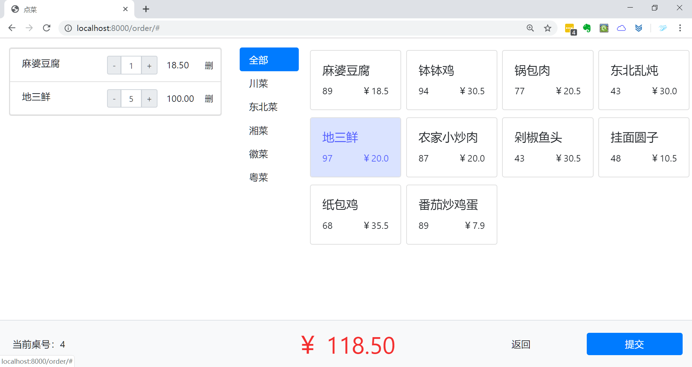
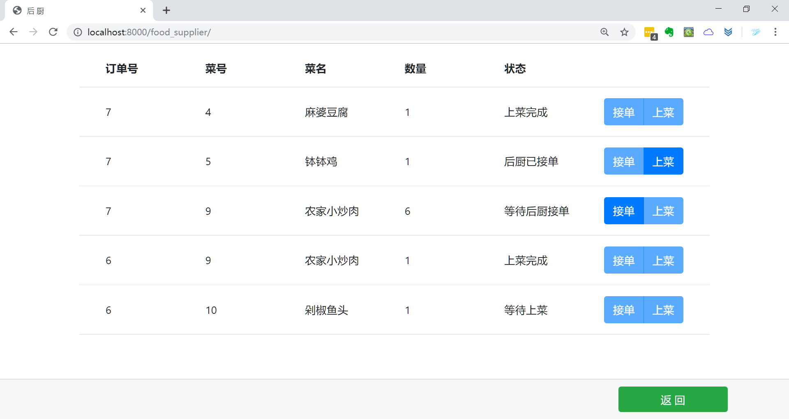
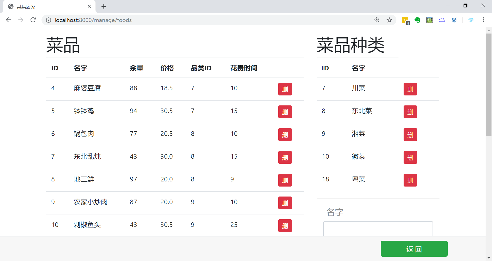

# 点菜管理系统


## 功能设计

该系统设计实现时主要从以下三个角色方面入手进行：

### 1. 用户端功能：

- 顾客进入系统浏览整体菜单；
- 顾客根据菜单进行选菜下单点菜；
- 顾客通过核对订单进行结账。

### 2. 后台管理功能：

- 管理员可以进入后台系统；

- 管理员可以查询系统内所有存在订单；

- 管理员有权对所有在职员工信息进行操作。

### 3. 后厨系统功能：

- 订单保存在数据库中，并传入后厨系统；

- 后厨界面同步显示所有正在进行的订单；

- 后厨对订单具有查询，接单等操作功能。


## 界面截图

### 主界面


### 点菜界面




### 后厨界面




### 管理界面

餐桌负责状态表中绿色表示有订单，红色表示后厨已经做好了菜，处于等待上菜阶段。

餐桌和上菜信息每30秒和每10秒动态刷新，仅刷新指定区域。

点击负责人可切换该桌负责人。


### 订单管理界面

点击订单号进入订单详情，绿色代表已支付订单，红色代表未支付订单。


### 订单详情界面


### 批量结账界面

点击单条订单可进入相应订单详情页。


### 菜品管理界面




## 使用

```shell
cd FoodOrder
python manage.py runserver
```

打开 [http://127.0.0.1:8000/](http://127.0.0.1:8000/)
