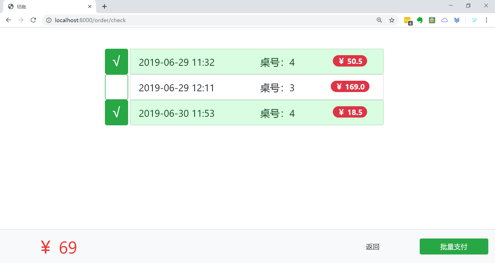

# 点菜管理系统

> [数据库课程设计报告.md](./数据库课程设计报告.md)

## 界面截图

### 主界面


### 点菜界面


### 后厨界面


### 管理界面

餐桌负责状态表中绿色表示有订单，红色表示后厨已经做好了菜，处于等待上菜阶段。

餐桌和上菜信息每30秒和每10秒动态刷新，仅刷新指定区域。

点击负责人可切换该桌负责人。


### 订单管理界面

点击订单号进入订单详情，绿色代表已支付订单，红色代表未支付订单。


### 订单详情界面


### 批量结账界面

点击单条订单可进入相应订单详情页。




### 菜品管理界面


## 使用

```shell
cd FoodOrder
python manage.py runserver
```

打开 [http://127.0.0.1:8000/](http://127.0.0.1:8000/)

