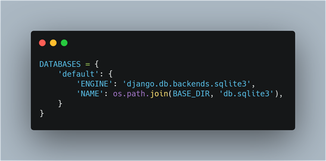
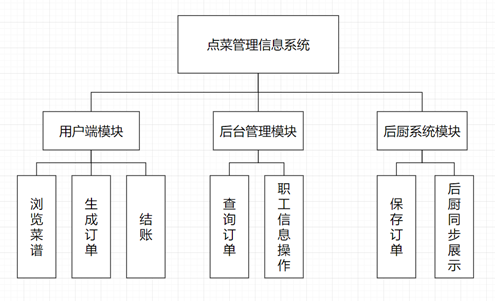
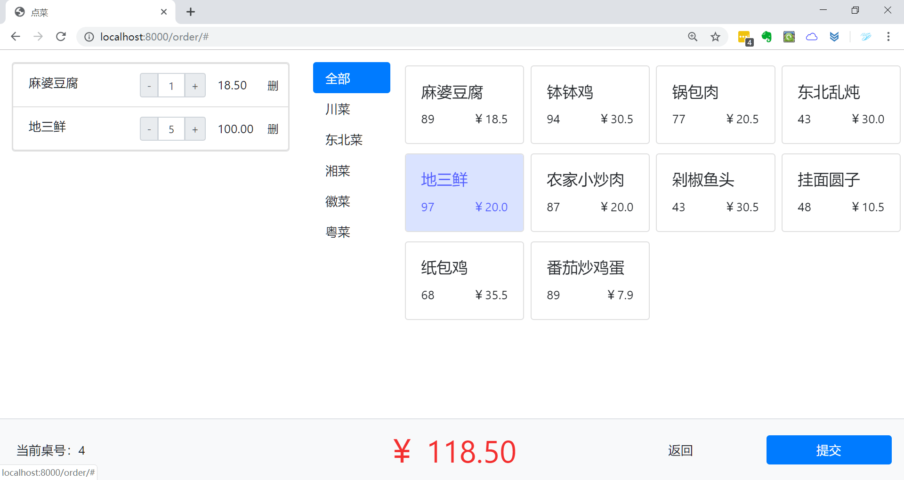
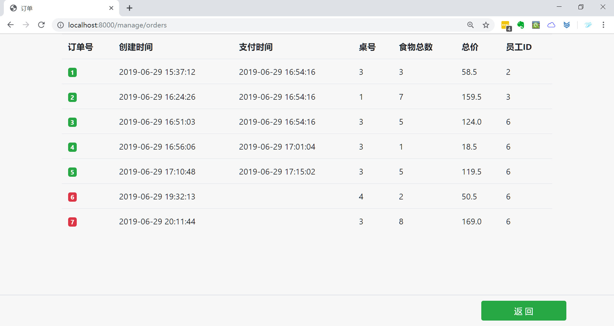
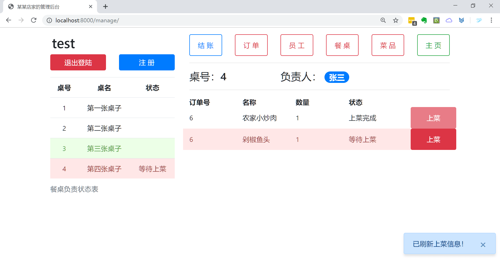
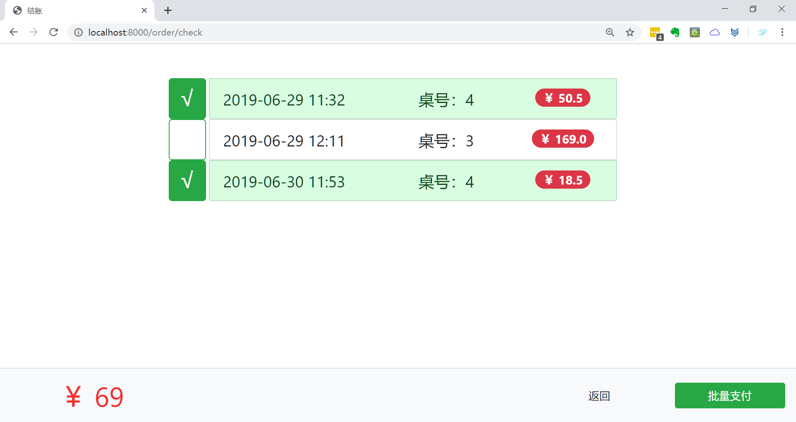
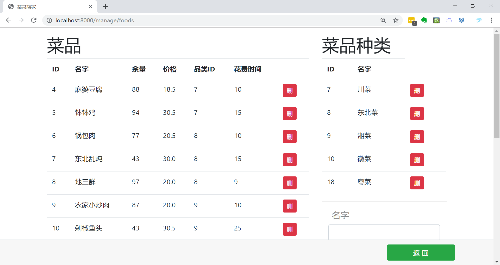
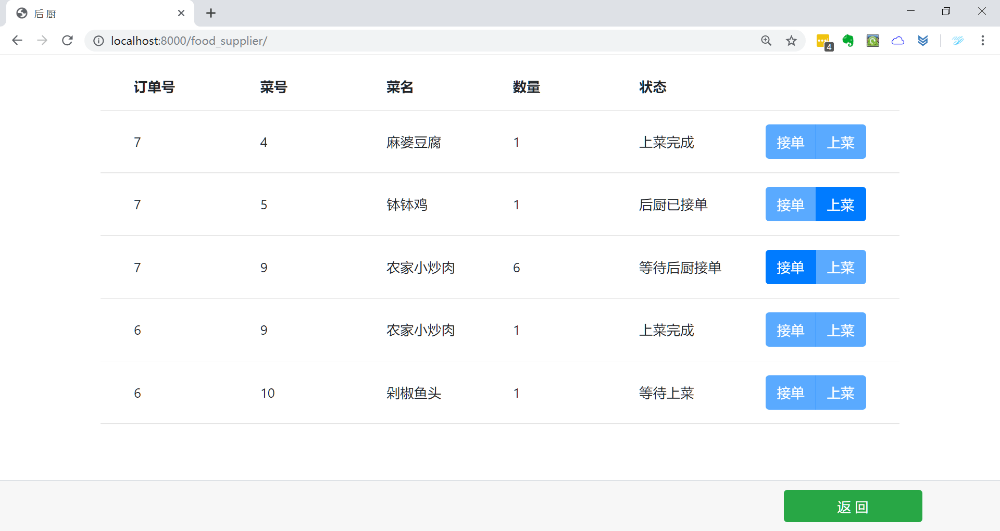

## 二、课程设计任务与要求： 

### 1、任务

**题目：点菜管理信息系统**

**问题描述：**  随着网络的迅速发展，越来越多的人开始接受甚至时依赖了网络营业的这种交易形式，传统的点菜模式不仅浪费时间，效率低下，而且特别耗费成本与人力，因此不少商家开始使用网上点菜系统。网上点菜系统是一种可以自主选择、个性化、便捷化、特色化的点餐模式，它的大力推广使用为餐厅节约了成本，同时也解决了消费者在传统点菜时存在的不少麻烦，这使得网上点菜系统迅速占领市场。

### 2、设计要求

该系统设计实现时主要从以下三个角色方面入手进行，每个角色具有不同功能：

1. 用户端功能： 
   - 顾客进入系统浏览整体菜单；
   - 顾客根据菜单进行选菜下单点菜；
   - 顾客通过核对订单进行结账。
2. 后台管理功能：
   - 管理员可以进入后台系统；
   - 管理员可以查询系统内所有存在订单；
   - 管理员有权对所有在职员工信息进行操作。
3. 后厨系统功能：
   - 订单保存在数据库中，并传入后厨系统；
   - 后厨界面同步显示所有正在进行的订单；
   - 后厨对订单具有查询，接单等操作功能。

## 三．课程设计说明书 

### 1 需求分析

#### (1) 数据需求

点菜管理信息系统需要完成功能主要有： 

1. 餐厅基础信息：餐厅提供基本的菜谱等信息并且能对所有信息进行增、删、改、查等操作；
2. 顾客点菜信息：用户登录系统后，在相应的页面浏览菜谱信息，根据自己的用餐需求下单，使得该信息显示在系统订单信息列表中，在结账时通过订单信息进行结账；
3. 职工管理信息：管理员可以登录该系统对已经注册的职工个人信息进行增、删、改、查等操作； 

#### (2) 事务需求

1. 在餐厅基础信息部分,要求: 
   - 展示整体菜谱，主要由菜品编号、菜名、数量、价格等组成；
   - 菜谱上所有信息管理员都有权进行更新修改。
2. 在顾客点菜信息部分,要求: 
   - 通过自主选择桌号进入点菜；
   - 浏览所有的菜谱信息；
   - 通过自主选择菜品，生成订单；
   - 核对订单信息及订单状态，完成结账。
3. 在职工管理信息部分，要求：
   - 在职员工通过身份信息注册、登陆系统；
   -  职工有权对自己的职工信息进行增、删、改等操作；
   - 管理员可以对所有职工信息进行查询及操作。

#### (3) 关系模式

1. 菜品类（<u>菜品编号</u>，菜品名称）
2. 菜品（<u>菜品编号</u>，菜品种类编号，菜名，制作时间，数量，价格）
3. 订单（<u>订单编号</u>，餐桌编号，菜品总数，消费金额，下单时间，备注信息，支付时间，负责职工编号，支付状态）
4. 订单明细（<u>编号</u>，订单编号，菜品编号，菜品数量，消费金额，备注信息，订单状态，接单时间，完成时间）
5. 职工（<u>职工编号</u>，个人ID，姓名，性别，出生日期，联系方式，联系地址）
6. 餐桌信息（<u>餐桌编号</u>，餐桌名字，负责职工编号）

 #### (4) 数据字典

1. 菜品类表

| 字段 | 类型        | 可否为Null | 主外码 | 默认值 | 中文名     |
| ---- | ----------- | ---------- | ------ | ------ | ---------- |
| ID   | Int         | NotNull    | 主码   |        | 菜品类编号 |
| name | Varchar(20) | NotNull    |        |        | 菜品类名称 |

2. 菜品表

| 字段        | 类型        | 可否为Null | 主外码 | 默认值 | 中文名       |
| ----------- | ----------- | ---------- | ------ | ------ | ------------ |
| ID          | Int         | NotNull    | 主码   |        | 菜品编号     |
| foodType_id | Int         |            | 外码   |        | 菜品种类编号 |
| title       | Varchar(20) | NotNull    |        |        | 菜名         |
| cost_time   | Int         |            |        |        | 制作时间     |
| amount      | Int         | NotNull    |        | 大于0  | 数量         |
| price       | Float       | NotNull    |        | 大于0  | 价格         |

3. 订单表

| 字段        | 类型        | 可否为Null | 主外码 | 默认值 | 中文名       |
| ----------- | ----------- | ---------- | ------ | ------ | ------------ |
| ID          | Int         |            | 主码   |        | 订单编号     |
| table_id    | Int         |            |        |        | 餐桌编号     |
| food_amount | Int         |            |        |        | 菜品总数     |
| table_price | Float       |            |        |        | 消费金额     |
| create_time | Varchar(20) |            |        |        | 下单时间     |
| pay_time    | Varchar(20) |            |        |        | 支付时间     |
| staff_id    | Int         |            | 外码   |        | 负责职工编号 |
| is-pay      | Boolean     |            |        |        | 支付状态     |
| comment     | Varchar(50) |            |        |        | 备注         |

4. 订单明细表

| 字段            | 类型        | 可否为Null | 主外键 | 默认值 | 中文名   |
| --------------- | ----------- | ---------- | ------ | ------ | -------- |
| id              | Int         |            | 主码   |        | 编号     |
| orderID_id      | Int         | NotNull    | 外码   |        | 订单编号 |
| foodID_id       | Int         | NotNull    | 外码   |        | 菜品编号 |
| amount          | Int         | NotNull    |        | 大于0  | 菜品数量 |
| sum_price       | Float       |            |        |        | 消费金额 |
| comment         | Varchar(50) |            |        |        | 备注信息 |
| status          | Varchar(20) | NotNull    |        |        | 订单状态 |
| start_cook_time |             |            |        |        | 接单时间 |
| end_cook_time   |             |            |        |        | 完成时间 |

5. 职工表

| 字段      | 类型        | 可否为Null | 主外键 | 默认值 | 中文名   |
| --------- | ----------- | ---------- | ------ | ------ | -------- |
| ID        | Int         | NotNull    | 主码   |        | 职工编号 |
| citizenID | Varchar(20) | NotNull    |        |        | 个人ID   |
| name      | Varchar(20) | NotNull    |        |        | 姓名     |
| gender    | Varchar(20) | NotNull    |        |        | 性别     |
| born_date | Varchar(20) |            |        |        | 出生日期 |
| phone     | Varchar(20) | NotNull    |        |        | 联系方式 |
| address   | Varchar(50) |            |        |        | 联系地址 |

6. 餐桌信息表

| 字段     | 类型 | 可否为Null | 主外键 | 默认值 | 中文名       |
| -------- | ---- | ---------- | ------ | ------ | ------------ |
| ID       |      |            | 主码   |        | 餐桌编号     |
| name     |      |            |        |        | 餐桌名字     |
| staff_id |      |            | 外码   |        | 负责职工编号 |

### 2 概要设计

#### (1) 实体图及E-R图


#### (2) 数据流图


### 3 逻辑设计


### 4 数据库建立 

#### (1) 创建数据库

Django 中默认使用 Sqlite 作为数据库，也可将其换为 MySql、Oracle 等，仅需提供连接地址、用户名及密码。



#### (2) 菜品类表建立

```sql
CREATE TABLE OrderSystem_foodtype
(
  ID  INTEGER   NOT NULL  PRIMARY KEY AUTOINCREMENT,
  name VARCHAR (20) NOT NULL
);
```

#### (3) 菜品表建立

```sql
CREATE TABLE OrderSystem_food
(
    title       VARCHAR (20) NOT NULL,
    amount      INTEGER      NOT NULL,
    price       REAL         NOT NULL,
    ID          INTEGER      NOT NULL  PRIMARY KEY AUTOINCREMENT,
	foodType_id INTEGER      NOT NULL  REFERENCES 
		OrderSystem_foodtype (ID)  DEFERRABLE INITIALLY DEFERRED,
    cost_time   INTEGER      NOT NULL
);
```

#### (4) 订单表建立

```sql
CREATE TABLE OrderSystem_order(
    ID          INTEGER  NOT NULL  PRIMARY KEY AUTOINCREMENT,
    table_id    INTEGER  NOT NULL,
    food_amount INTEGER  NOT NULL,
    total_price REAL     NOT NULL,
    staff_id    INTEGER  NOT NULL  REFERENCES
		OrderSystem_staff (ID) DEFERRABLE INITIALLY DEFERRED,
    is_pay      BOOL     NOT NULL,
    create_time DATETIME NOT NULL,
	pay_time    DATETIME，
	comment     VARCHAR (50) NOT NULL
);
```

#### (5) 订单明细表建立

```sql
CREATE TABLE OrderSystem_orderitem 
(
    id              INTEGER      NOT NULL  PRIMARY KEY AUTOINCREMENT,
    amount          INTEGER      NOT NULL,
    sum_price       REAL         NOT NULL,
    orderID_id      INTEGER      NOT NULL  REFERENCES
		OrderSystem_order (ID) DEFERRABLE INITIALLY DEFERRED,
    end_cook_time   TIME,
    start_cook_time TIME,
    status          INTEGER      NOT NULL,
    comment         VARCHAR (50) NOT NULL,
	foodID_id       INTEGER      REFERENCES 
	OrderSystem_food (ID) DEFERRABLE INITIALLY DEFERRED
);
```

#### (6) 职工信息表建立

````sql
CREATE TABLE OrderSystem_staff 
(
    ID        INTEGER      NOT NULL  PRIMARY KEY AUTOINCREMENT,
    citizenID VARCHAR (20) NOT NULL,
    name      VARCHAR (10) NOT NULL,
    gender    VARCHAR (5)  NOT NULL,
    born_date DATE,
    phone     VARCHAR (11) NOT NULL,
    address   VARCHAR (50) NOT NULL
);
````

#### (7) 餐桌信息表建立

```sql
CREATE TABLE OrderSystem_staff_table 
(
  ID    INTEGER   NOT NULL PRIMARY KEY,
  name   VARCHAR (20) NOT NULL,
  staff_id INTEGER   NOT NULL  REFERENCES
  	OrderSystem_staff (ID) DEFERRABLE INITIALLY DEFERRED
);
```

### 5 系统实现

#### （1）系统功能模块图


#### （2）前台开发平台的选择
- web 前端使用 jQuery、Bootstrap4 等进行实现;
- 使用 Python + Django 作为后端实现；
- 使用 Sqlite 进行数据库实现。

#### （3）设计与实现
1. 展示所有菜品类及菜品，顾客可以自主选择餐桌及菜品来进行下单

   

2. 生成订单明细，顾客可以对自己的订单进行查询核对

   
   
3. 管理员及职工注册，然后通过登陆进入后台管理系统


4. 后台管理系统同步显示订单及当前订单所有状态，后厨完成订单时选择上菜，管理界面自动刷新提示服务员进行上菜服务，餐桌负责人后台可自行切换

   

5. 点击结账时可以先核对订单，然后再进行对订单的批量支付或者全部支付

   

6. 后台管理系统显示所有订单以及订单支付状态，红色为未支付订单，绿色为已支付订单，点击订单号可进入对应订单的详情页

   

7. 管理员对菜品类、菜品、餐桌信息、员工信息等进行更新操作，即增、删、改等

   

8. 进如后厨系统，后厨对订单信息进行选择接单，完成后通知上菜等操作，订单明细显示4种状态（等待后厨接单，后厨已接单，等待上菜，上菜完成）

   

### 6 编程与调试总结
在前端遇到的最多的问题就是对齐，在 javascript 以及 jQuery 的操作中，经常会发生无法绑定的情况，后来知道是因为我们的页面是动态加载，一次绑定无法将新的 html 元素也进行绑定，最后统一将绑定的操作放在了动态加载之后，而管理和后厨页面中的一些元素需要隔10秒、30秒刷新餐桌信息和上菜信息的就需要在刷新的函数后面再进行绑定。

用 Django 写后端还是比较容易的，但是因为不是很熟悉这个框架，所以在 url 的路由设置上没有很清晰的分界，将管理与顾客点菜子系统放在了同一个 app 中，虽然便于处理数据，但是导致一个 app 的内容很多，不便于调试时查找，使得代码可读性变低，但好在 Django 框架将后端分为了页面视图 views、页面模板 templates 和数据关系模型 models 等，代码的耦合度不至于很高。

在做管理页面时遇到了数据库关系表中的外键在被参照表中数据被删除时参照表需不需要级联删除的问题，因为一开始将其设计成了SET_NULL，但是实际调试时发现数据库报错，将SQL语句放在数据库中执行发现无法将其设为NULL，最后查阅了相关问题的资料后将其设计成可以为空。

### 7 课程设计心得体会
这次的数据库课程设计只有一个星期的时间，而我们需要将在数据库课堂上和实验中学习到的知识运用到实际的管理系统中，还需要设计相应的界面，这着实不是一件容易的事情。

确定选择“点菜管理系统”这个题目后，我们通过查找相关资料以及自己对点菜系统的理解确定了需要做的几个主要功能：点菜、结账、查账等，然后一点一点拓展到现在的所有功能。功能的完善大多是在开发过程中因为实际需要而发现问题并解决的，还有的是为了更人性化更适合用户角度使用而添加的，相应的数据库表单也是在开发过程中逐步完善。

但是这样的开发是有问题的，比如订单的几个数据项前前后后改了很多次，因为生成订单需要前后端沟通，每次修改也就会耗费许多时间来进行调试，而如果一开始就能详细地对订单表进行描述，在后期不需要添加新的主属性，那么一定会减少很多可压缩的调试时间。

在开发技术方面，这次尝试了 Python 的 Web 框架 Django 作为后端的 Web 应用，后端的数据库使用了 Django 推荐的 Sqlite ，虽然不适合实际生产环境，但是便于上手，也使得我们能够在系统的其他地方进行一点点细节上的打磨，前端使用了 Bootstrap4 + jQuery 来开发。

在开发前期，许多时间用在了前端的细节优化上，通过Bootstrap将界面统一风格，也因此将管理页面中订单和上菜提醒直观表现出来，不需要进入二级菜单就能将上菜信息传达上来。在后期逐渐将数据存储所需的约束与触发操作完善，使得各个关系合理存在。

这次数据库课设对我们来说是一个综合能力的考验，也是将数据库系统与所学知识的结合，通过这次课设，我对数据库设计能力有了很大提高，也学会了在应用中引入数据库、维护数据库，不过所体现的问题也是以后需要不断学习、实践的地方。

### 8 参考文献

> [1] 范长青. 智能点菜系统设计开发与引用[J].微型电脑应用. 2019-06-14
> [2] 石爱好. 基于SQL Server 2012数据库的应用及研究[J].电脑迷. 2017(03)
> [3] 单立娟. 数据库技术在移动点菜系统上的应用[J].数字技术与应用. 2016-08-15
> [4] 于卓立，刘沙沙，苏家鹏，宋文苑，邹晓琳. 智能餐桌系统设计与实现[J].电脑编程技术与维护. 2014-12-18
> [5] 李源. 餐厅点菜系统的设计与实现[J].电子技术与软件工程. 2015-10-16
> [6] 王欣. 智能电子点菜系统的研究[J].北京交通大学. 2017-06-01
> [7] 尹亮. 餐厅点菜及后厨系统的设计与实现[J].电子科技大学. 2015-03-15


